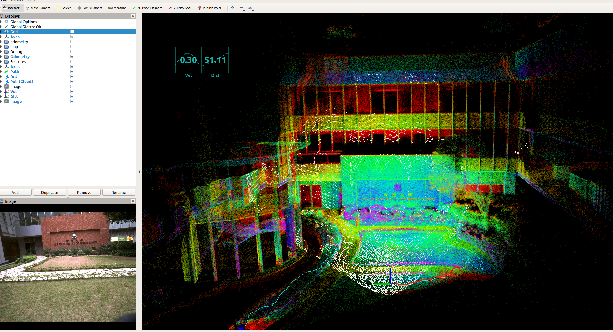
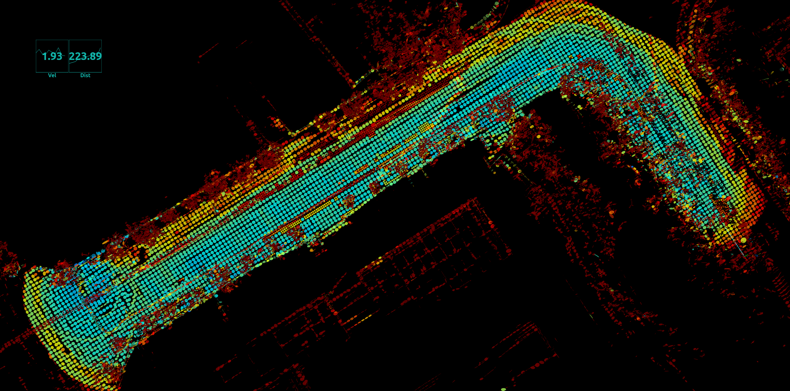
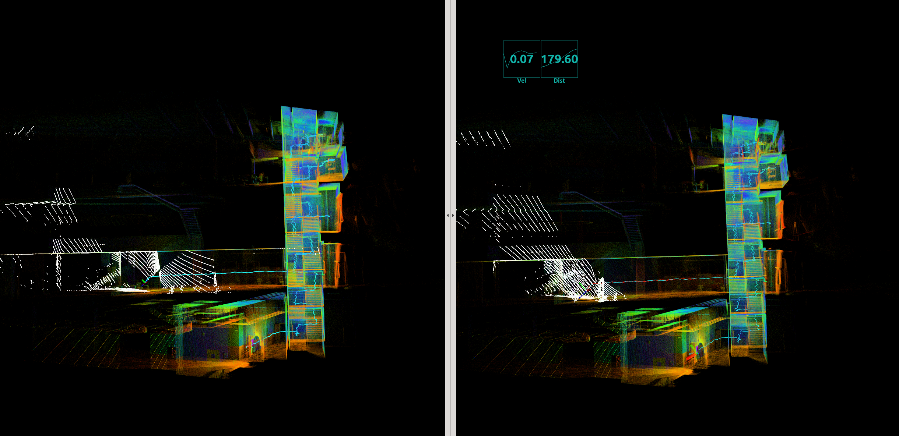
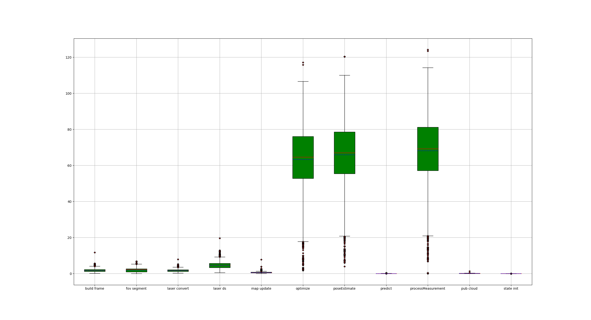

# ct-lio
CT-LIO: Continuous-Time LiDAR-Inertial Odometry

**ct-lio** (Continuous-Time LiDAR-Inertial Odometry) is an accurate and robust LiDAR-inertial odometry (LIO). It fuses LiDAR constraints(ct-icp) with IMU data using ESKF(loose couple) to allow robost localizate in fast motion (as lio-sam). Besides, we provide **analytical derivation and automatic derivation** for ct-icp, and a simple **degradation detection**.

<!-- - [Video-Bilibili](https://www.bilibili.com/video/BV1CP411k7hE/?spm_id_from=333.999.0.0&vd_source=438f630fe29bd5049b24c7f05b1bcaa3) -->
  
<div align="center">
    <a href="https://www.bilibili.com/video/BV1CP411k7hE/?spm_id_from=333.999.0.0&vd_source=438f630fe29bd5049b24c7f05b1bcaa3" target="_blank">
    
</div>


## NOTE: Click on the image to view the corresponding video.

## Update
- 2023.08.18: 
    1. support pandar lidar(test with Hilti2022 dataset) 
    2. Test with ICCV2023  challenge (SubT_MRS_Final_Challenge_UGV1)
    <div align="center">
    <!-- <a href="https://www.bilibili.com/video/BV1rX4y1j7ur/?spm_id_from=333.999.0.0&vd_source=438f630fe29bd5049b24c7f05b1bcaa3" target="_blank"> -->
    
</div>

- 2023.08.16: support Livox serials LiDAR.
  <div align="center">
    <!-- <a href="https://www.bilibili.com/video/BV1rX4y1j7ur/?spm_id_from=333.999.0.0&vd_source=438f630fe29bd5049b24c7f05b1bcaa3" target="_blank"> -->
    
</div>

- 2023.08.05: voxelmap based ct_lio will upload later.

<div align="center">
    <a href="https://www.bilibili.com/video/BV1rX4y1j7ur/?spm_id_from=333.999.0.0&vd_source=438f630fe29bd5049b24c7f05b1bcaa3" target="_blank">
    
</div>

- 2023.07.27: A tight-coupled [hm-lio](https://github.com/chengwei0427/hm-lio) is released. It is a hash-map based lio.

### Some test results are show below:

#### Velodyne 32, NCLT dataset
(mode:normal + eskf)
<!-- - [Video-Bilibili](https://www.bilibili.com/video/BV15s4y1F79a/?spm_id_from=333.999.0.0&vd_source=438f630fe29bd5049b24c7f05b1bcaa3) -->

<div align="center">
    <a href="https://www.bilibili.com/video/BV15s4y1F79a/?spm_id_from=333.999.0.0&vd_source=438f630fe29bd5049b24c7f05b1bcaa3" target="_blank">
    
</div>

#### Ouster-32, multi-layer office 
<!-- - [Video-Bilibili](https://www.bilibili.com/video/BV1g14y1U7R4/?spm_id_from=333.999.0.0&vd_source=438f630fe29bd5049b24c7f05b1bcaa3) -->
  
**Left**: ours (mode:normal + eskf)

**Right**: fast-lio2

<div align="center">
    <a href="https://www.bilibili.com/video/BV1g14y1U7R4/?spm_id_from=333.999.0.0&vd_source=438f630fe29bd5049b24c7f05b1bcaa3" target="_blank">
    
</div>


#### Robosense RS16, staircase_crazy_rotation dataset
<!-- - [Video-Bilibili](https://www.bilibili.com/video/BV19m4y1E7ry/?spm_id_from=333.999.0.0&vd_source=438f630fe29bd5049b24c7f05b1bcaa3) -->

**Left**: PV_LIO

**Right**: ours (mode:normal + eskf)

<div align="center">
    <a href="https://www.bilibili.com/video/BV19m4y1E7ry/?spm_id_from=333.999.0.0&vd_source=438f630fe29bd5049b24c7f05b1bcaa3" target="_blank">
    
</div>
  

#### Velodyne 16, LIO-SAM dataset
**Left**: ours (mode:normal + eskf)

**Right**: direct_lidar_inertial_odometry

 

#### Velodyne 16, LIO-SAM dataset

(mode:CT + eskf)

 


## 1. Prerequisites

### 1.1 **Ubuntu** and **ROS**
**Ubuntu >= 18.04**

For **Ubuntu 18.04 or higher**, the **default** PCL and Eigen is enough for ct_lio to work normally.

ROS    >= Melodic. [ROS Installation](http://wiki.ros.org/ROS/Installation)

### 1.2. **PCL && Eigen**
PCL    >= 1.8,   Follow [PCL Installation](http://www.pointclouds.org/downloads/linux.html).

Eigen  >= 3.3.4, Follow [Eigen Installation](http://eigen.tuxfamily.org/index.php?title=Main_Page).


## 2. Build

Clone the repository and catkin_make:

**NOTE**:**[This is import]** before catkin_make, make sure your dependency is right(you can change in ./cmake/packages.cmake)

```
    cd ~/$A_ROS_DIR$/src
    git clone https://github.com/chengwei0427/ct-lio.git
    cd ct_lio
    cd ../..
    catkin_make
    source devel/setup.bash
```

- If you want to use a custom build of PCL, add the following line to ~/.bashrc
```export PCL_ROOT={CUSTOM_PCL_PATH}```
  
## 3. Directly run

**Noted:**

**A**. Please make sure the IMU and LiDAR are **Synchronized**, that's important.

**B**. The warning message "Failed to find match for field 'time'." means the timestamps of each LiDAR points are missed in the rosbag file. That is important for the forward propagation and backwark propagation.

**C**. Before run with **NCLT** dataset, you should change time-scale in **cloud_convert.cpp**( static double tm_scale = 1e6)

**D**. Run with a bag directly.

1. uncomment the node in the launch file with "main_eskf_rosbag"
2. change the bag name in the ./apps/main_eskf_rosbag.cpp ,such as  'std::string bag_path_ = "/media/cc/robosense16/2023-04-16-21-39-59_new.bag";'
3. re compile the code
4. run with launch file

**E**. change analytical derivation and automatic derivation in **./lio/lidarodom.cpp**  with #define USE_ANALYTICAL_DERIVATE 


## 4. Rosbag Example
### 4.1 Robosense 16 Rosbag 

<div align="left">

</div>

Files: Can be downloaded from [Baidu Pan (password:4kpf)](https://pan.baidu.com/s/1VHIVYo2LAyFKzMzdilOZlQ) or [Google Drive](https://drive.google.com/drive/folders/1f-VQOORs1TA5pT-OO_7-rG0kW5F5UoGG?usp=sharing)

**Noted**
  - For this narrow staircases, should adjust the params(such as surf_res etc.) before run the program.
  - mapping.yaml is [here](https://github.com/chengwei0427/ct-lio/issues/2#issuecomment-1639878868)
  - make sure the external params are correct [ISSUE #2](https://github.com/chengwei0427/ct-lio/issues/2)
  - un-comment the code for staircase.bag [lio->pushData()](https://github.com/chengwei0427/ct-lio/blob/a05af59c032ff08df6905b06d2776a753d187741/src/apps/main_eskf.cpp#L60) (The lidar header timestamp of this dataset is the frame end.)

Run:
```
roslaunch ct_lio run_eskf.launch
cd YOUR_BAG_DOWNLOADED_PATH
rosbag play *
```

### 4.2 Time analysis

There is a time log file in **./log/** after run the code. we can plot the time with the scripts.
```
cd CT-LIO
python3 ./scripts/all_time.py
```
<div align="left">
 
</div>

## Related Works
1. [ct_icp](https://github.com/jedeschaud/ct_icp):  Continuous-Time LiDAR Odometry .
2. [slam_in_autonomous_driving](https://github.com/gaoxiang12/slam_in_autonomous_driving): SLAM in Autonomous Driving book
3. [semi_elastic_lio](https://github.com/ZikangYuan/semi_elastic_lio): Semi-Elastic LiDAR-Inertial Odometry.


## TBD
1. Fuse relative pose from other odometry as measurement in the update process when degenration is detected.
2. Add **zupt** when zero velocity is detected.
3. More experiments.

